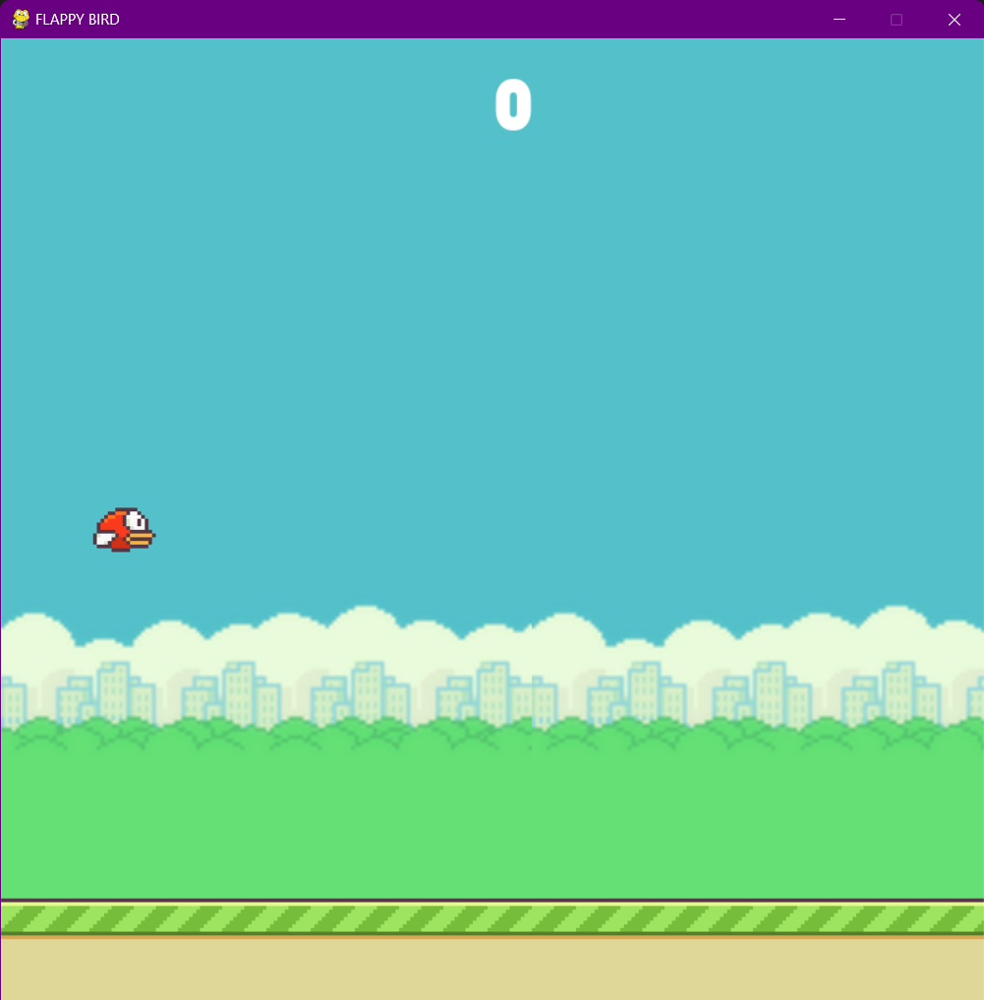
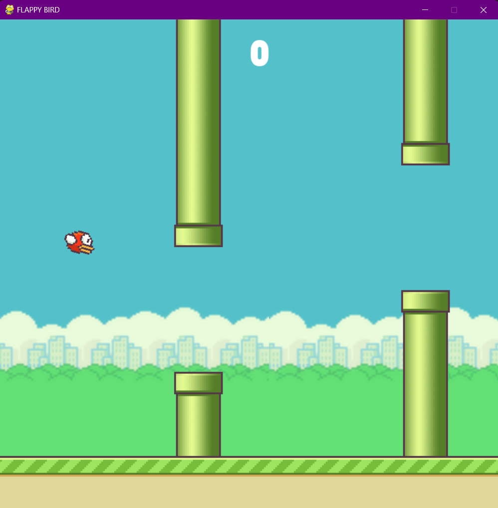
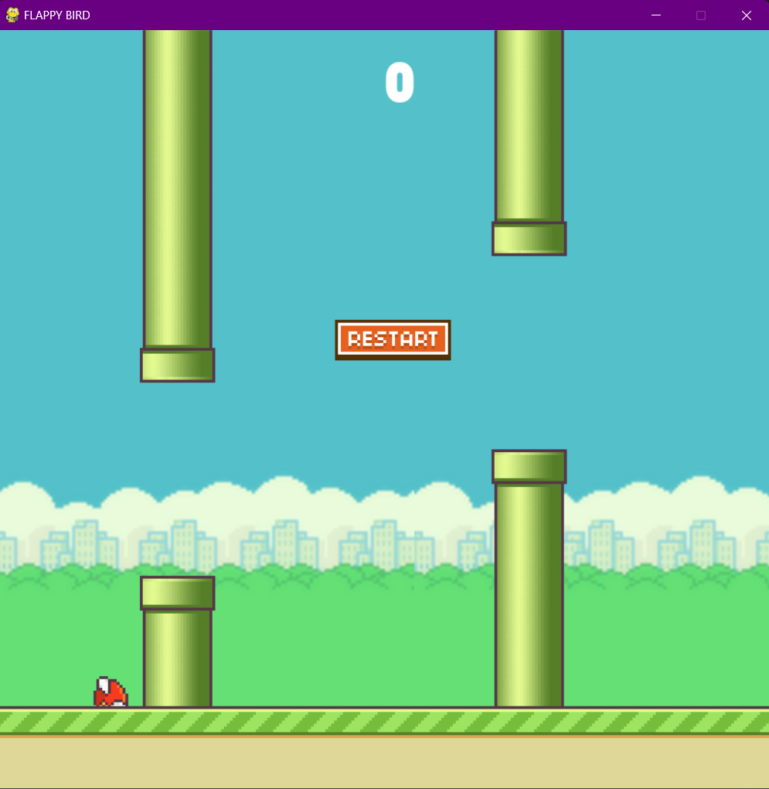

# Flappy Bird Game

Welcome to the **Flappy Bird Game**, a Python-based recreation of the popular mobile game using the Pygame library. This project is designed to provide a fun and interactive gaming experience while showcasing fundamental game development concepts.

## 🎮 Game Overview

Flappy Bird is a simple arcade game where the player controls a bird and navigates it through pipes without crashing. The goal is to achieve the highest score by passing through as many pipes as possible.

## 🛠️ Features

- **Smooth Gameplay**: Built using Pygame for high performance and responsiveness.
- **Dynamic Difficulty**: Randomized pipe heights for an engaging challenge.
- **Score Tracking**: Tracks the player's score based on successfully passed pipes.
- **Game Over Reset**: Restart the game easily with a click of a button.
- **Realistic Physics**: Gravity effect and fluid animations for an immersive experience.
- **Custom Graphics**: Unique sprites for the bird, pipes, and background.

## 🎮 How to Play

1. Clone this repository:
   ```bash
   git clone https://github.com/yourusername/flappy-bird-game.git
2. Navigate to the project directory
   ```bash
   cd flappy-bird-game
3. Ensure you have Python installed with the Pygame library:
   ```bash
   pip install pygame
4. Run the game:
   ```bash
   python flappy_bird.py

## 🎨 Game Controls

- **Mouse Click**: Make the bird flap its wings.
- **Restart Button**: Restart the game after a game-over.

## 📸 Screenshots

### Starting

*This is how the starting of the game looks like, click on the screen to start the game*

### Playing 

*This is the screenshot from the game play*

### Restart

*Click restart to start the game once you hit the pipe*

## 🧑‍💻 Author

**Sabarinadh**  
[GitHub Profile](https://github.com/Sabarinadh2002)

